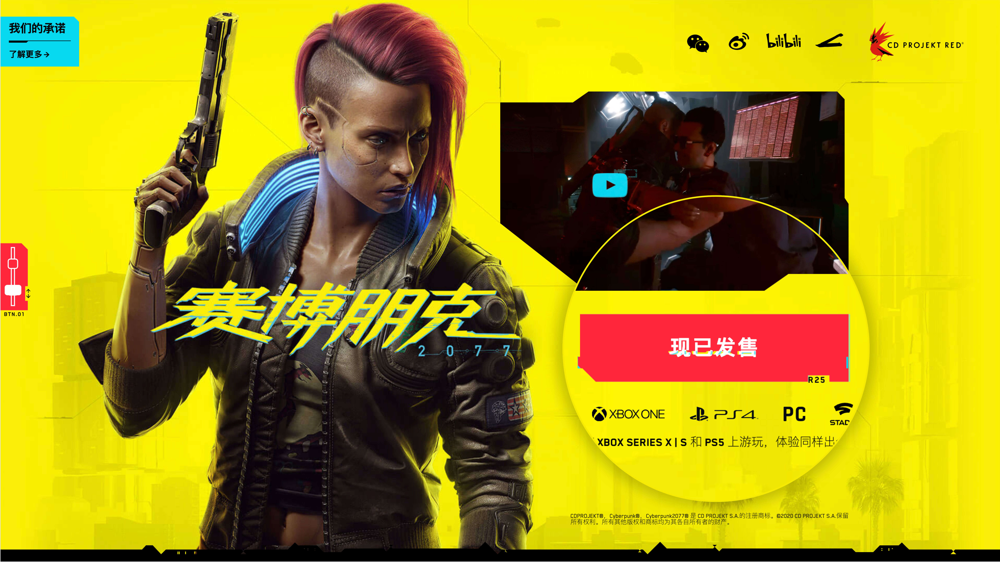
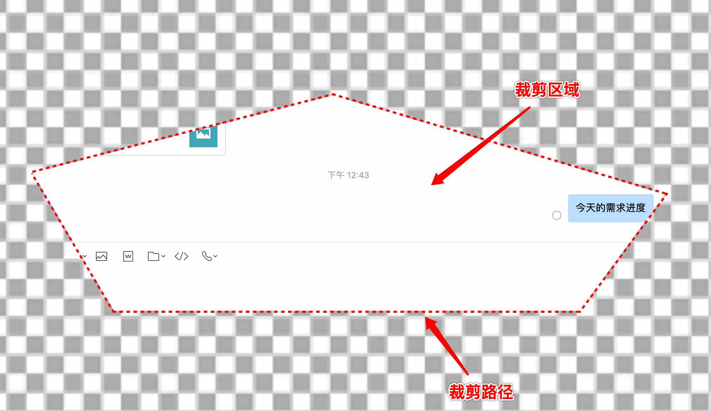
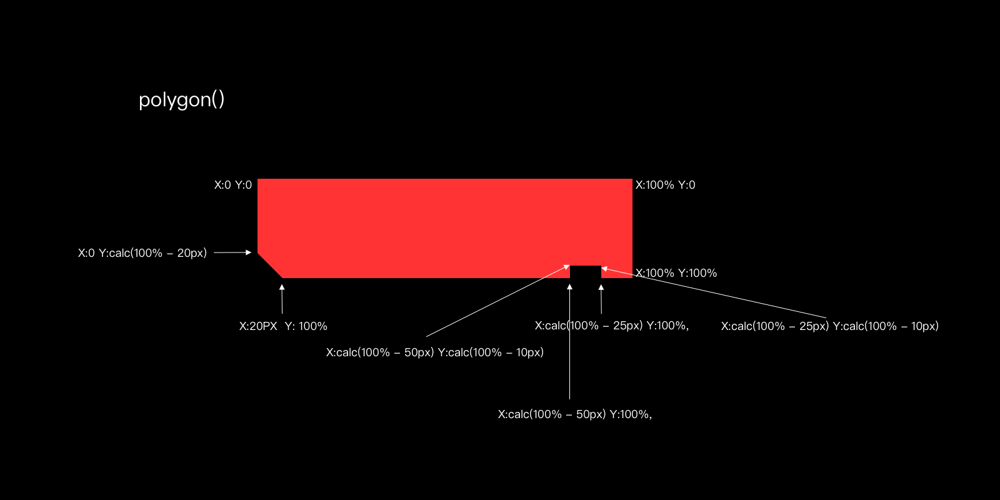
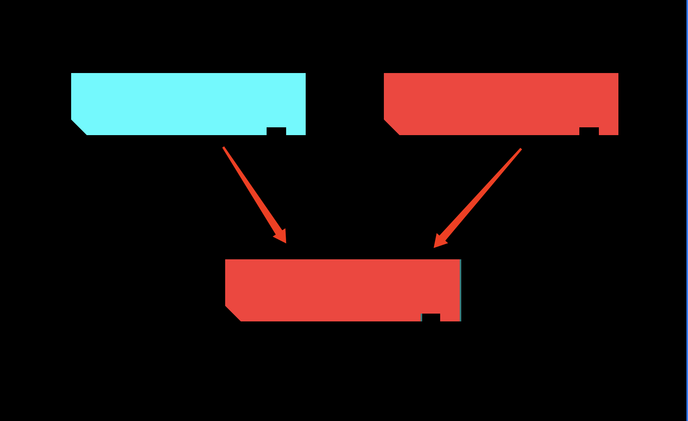
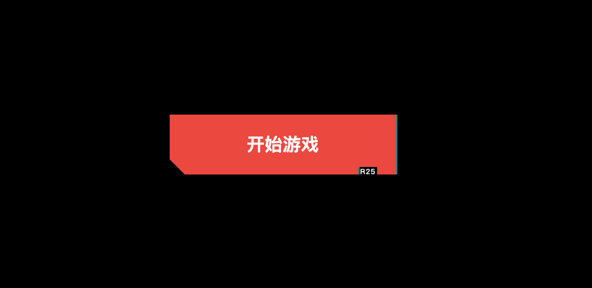
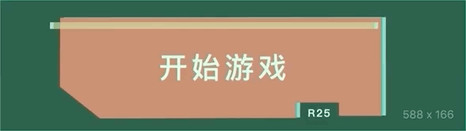

最近经常能听到身边高端玩家提起的赛博朋克 2077 这款游戏有多好玩，看了一下配置要求，em... 是我玩不起的那种。但... 这个按钮我可以。



这个按钮使用了一个色差故障的效果，2077 官网的做法是用了 SVG 作为背景图。
在这里可以使用 CSS 的 clip-path 去实现。

<br />

## 一、clip-path 是什么? 它的作用是什么?

clip-path 从单词上直译过来就是“裁剪路径”，效果可以理解为 PS 里面的蒙版操作，它的作用是对元素进行“裁剪”。clip-path 的出现让我们在不使用图片的情况下，可以绘制出很多特殊不规则的图形。



clip-path 简单的工作原理是提供一系列的 X 和 Y 值来创建路径。当使用这些值创建一条完整的路径时，就会把图像按照路径内部的尺寸进行裁剪。
利用 clip-path，我们可以创建圆形，椭圆和多边形等不同的形状。

- **裁剪**：就是从某样东西剪切一块。比如在上图，根据需求剪切出一部分想要保留的区域。

- **裁剪路径**：是用来裁剪元素的路径，它标记了我们需要裁剪的区域，如上图中的红色虚线。它可以是简单的形状（如 WEB 中常见的矩形），也可以是复杂的、不规则的多边形。

- **裁剪区域**：是裁剪路径闭合后所包含的全部区域。

<br />

## 二、clip-path 语法使用

- **inset()**：用于定义一个插进的矩形，即被剪裁元素内部的一块矩形区域
	```css
    //语法
    inset( <length-percentage>{1,4} [ round <border-radius> ]? )

    //说明
    inset()可以传入5个参数，分别对应top,right,bottom,left的裁剪位置,round radius（可选，圆角）

    //示例
    clip-path: inset(2em 3em 2em 1em round 2em)
	```

- **circle()**：定义一个圆
	```css
    //语法
    circle( [ <shape-radius> ]? [ at <position> ]? )

    //说明
    circle()可以传人2个可选参数；
    1. 圆的半径，默认元素宽高中短的那个为直径，支持百分比
    2. 圆心位置，默认为元素中心点

    //示例
    clip-path: circle(30% at 50% 50%);
	```
- **ellipse()**: 定义一个椭圆 
  ```css
    //语法
    ellipse( [ <shape-radius>{2} ]? [ at <position> ]? )

    //说明
    ellipse()可以传入3个可选参数；
    1. 椭圆的X轴半径，默认是宽度的一半，支持百分比
    2. 椭圆的Y轴半径，默认是高度的一半，支持百分比
    3. 椭圆中心位置，默认是元素的中心点

    //示例
    clip-path: ellipse(45% 30% at 50% 50%);
  ```
- **polygon()**：定义一个多边形 
  ```css
    //语法
    polygon( <fill-rule>? , [ <length-percentage> <length-percentage> ]# )

    //说明
    <fill-rule>可选，表示填充规则用来确定该多边形的内部。可能的值有nonzero和evenodd,默认值是nonzero
    后面的每对参数表示多边形的顶点坐标（X,Y），也就是连接点
    
    //示例
    clip-path: polygon(50% 0,100% 50%,0 100%);
  ```

<br />

## 三、实现过程

根据这个按钮的设计，我们可以使用 `polygon()` 这个值来制作。`polygon()` 的参数是按照顺时针指定多个坐标点进行裁剪。

1. 首先我们需要画出一个矩形，并给它做好裁剪

```html
<div class="glitch"></div>
<style>
.glitch{
  clip-path: polygon(
  0 0,
  100% 0,
  100% 100%,
  calc(100% - 25px) 100%,
  calc(100% - 25px) calc(100% - 10px),
  calc(100% - 50px) calc(100% - 10px),
  calc(100% - 50px) 100%,
  20px 100%,
  0 calc(100% - 20px)
  );
}
</style>
```



<br />

2. 右侧天蓝色的阴影，它不能直接用 `box-shadow` 来定义，因为缺口处的阴影超出了蒙版的范围。那么可以用 `before` 和 `after` 伪元素设置两个一样的蒙版形状。把 `after` 设置为按钮的颜色，`before` 设置为阴影，然后对 `before` 偏移 `2px`



<br />

3. 字体部分就比较简单，直接使用绝对定位移动到缺口位置就可以了



5. 色差故障实现，按钮的横条扫描效果也是使用了 `chip-path` 裁剪出一个长方形的部分，再配合 `animation` 进行由上到下，从左到右的过渡效果。这里我们不能对原按钮进行移动，需要重新定义一个元素。



<br />

## 源码演示

```html
<style>
main {
  width: 100vw;
  height: 100vh;
  display: flex;
  align-items: center;
  justify-content: center;
  background-color: #fff04d;
}
.button{
  width: 300px;
  height: 80px;
  background: none;
  display: flex;
  align-items: center;
  justify-content: center;
  position: relative;
  cursor: pointer;
}
.button::before,
.button::after,
.glitch{
  content: '';
  position: absolute;
  width: 100%;
  height: 100%;
  left: 0;
  top: 0;
  display: block;
}

.button::before,
.button::after,
.glitch{
  clip-path: polygon(
    0 0,
    100% 0,
    100% 100%,
    calc(100% - 25px) 100%,
    calc(100% - 25px) calc(100% - 10px),
    calc(100% - 50px) calc(100% - 10px),
    calc(100% - 50px) 100%,
    20px 100%,
    0 calc(100% - 20px)
  );
}

.button::before{
  left: 2px;
  background-color: rgba(0, 255, 255, .5);
}

.button::after{
  background-color: #ff3333;
}

.glitch {
  background: #ff3333;
  box-shadow: 0 0 0 1px #00ffff inset;
  z-index: 10;
  opacity: 0;
}

.text {
  font-size: 24px;
  font-weight: 800;
  color: #fff;
  position: relative;
  z-index: 15;
}

.text::before {
  content: attr(data-text);
  position: absolute;
  display: block;
  top: 0;
  left: 0;
  text-shadow: 1px 1px #00ffff,
    -1px -2px #ffdd33;
  opacity: 0;
}

.button:hover .glitch,
.button:hover .text::before {
  animation: glitch-effect 2s infinite;
  opacity: 1;
}

.platform {
  position: absolute;
  right: 24px;
  bottom: -4px;
  font-size: 10px;
  transform: scale(0.8);
  letter-spacing: 1px;
  font-weight: 500;
}
@keyframes glitch-effect {
  0% {
    clip-path: polygon(0 0, 100% 0, 100% 2%, 0 2%);
  }
  5% {
    clip-path: polygon(0 8%, 100% 8%, 100% 16%, 0 16%);
  }
  10% {
    clip-path: polygon(0 80%, 100% 80%, 100% 88%, 0 88%);
    transform: translate3d(-5px, 0, 0);
  }
  15% {
    clip-path: polygon(0 80%, 100% 80%, 100% 88%, 0 88%);
    transform: translate3d(5px, 0, 0);
  }
  16% {
    clip-path: polygon(0 80%, 100% 80%, 100% 88%, 0 88%);
    transform: translate3d(5px, 0, 0);
  }
  17% {
    clip-path: polygon(0 90%, 100% 90%, 100% 100%, 0 100%);
    transform: translate3d(5px, 0, 0);
  }
  18% {
    clip-path: polygon(0 0, 0 0, 0 0, 0 0);
  }
  20% {
    clip-path: polygon(0 30%, 100% 30%, 100% 65%, 0 65%);
  }
  25% {
    clip-path: polygon(0 30%, 100% 30%, 100% 65%, 0 65%);
    transform: translate3d(-5px, 0, 0);
  }
  28% {
    clip-path: polygon(0 30%, 100% 30%, 100% 65%, 0 65%);
    transform: translate3d(-5px, 0, 0);
  }
  29% {
    clip-path: polygon(0 30%, 100% 30%, 100% 65%, 0 65%);
    transform: translate3d(5px, 0, 0);
  }
  30% {
    clip-path: polygon(0 75%, 100% 75%, 100% 100%, 0 100%);
  }

  40% {
    clip-path: polygon(0 45%, 100% 45%, 100% 60%, 0 60%);
  }
  42% {
    clip-path: polygon(0 45%, 100% 45%, 100% 60%, 0 60%);
    transform: translate3d(-5px, 0, 0);
  }
  45% {
    clip-path: polygon(0 45%, 100% 45%, 100% 60%, 0 60%);
    transform: translate3d(5px, 0, 0);
  }
  48% {
    clip-path: polygon(0 45%, 100% 45%, 100% 60%, 0 60%);
    transform: translate3d(-5px, 0, 0);
  }
  50% {
    clip-path: polygon(0 0, 0 0, 0 0, 0 0);
  }
  60% {
    clip-path: polygon(0 100%, 100% 100%, 100% 100%, 0 100%);
  }
  100% {
    clip-path: polygon(0 100%, 100% 100%, 100% 100%, 0 100%);
    transform: translate3d(0, 0, 0);
  }
}
</style>

<main>
  <div class="button">
    <div class="glitch"></div>
    <div class="text" data-text="开始游戏">开始游戏</div>
    <span class="platform">R25</span>
  </div>
</main>
```

## 参考资料

- [clip-path](https://developer.mozilla.org/en-US/docs/Web/CSS/clip-path)
- [峰华前端](https://github.com/zxuqian/html-css-examples/tree/master/27-glitch-effect)
- [查看兼容](http://caniuse.com/#search=clip-path)
- [在线工具](https://bennettfeely.com/clippy/)